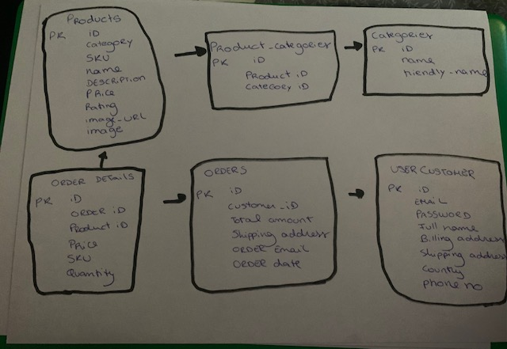
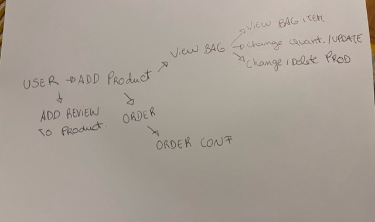
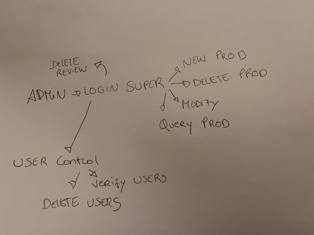
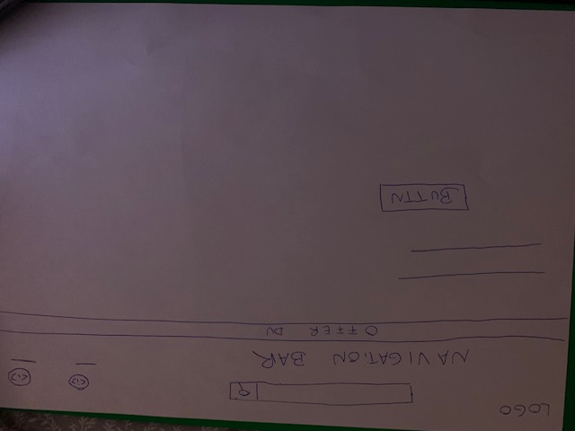
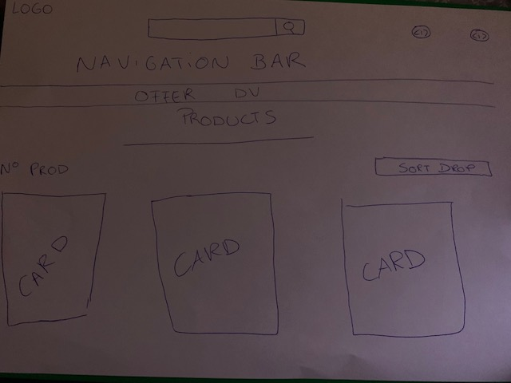
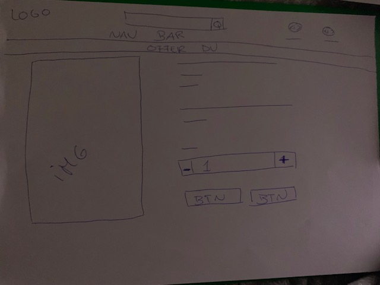
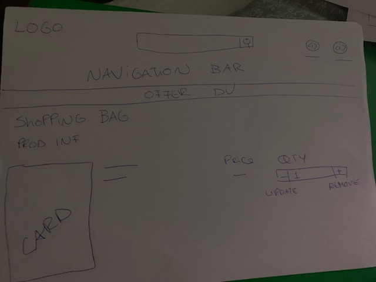
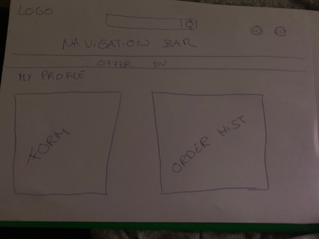
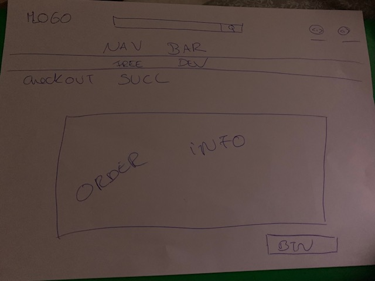
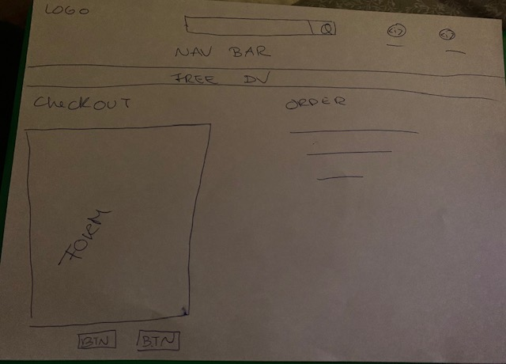

# Make.Me.Up

## Overview
---
Live Website Here [Make.Me.Up](https://makemeupbymaria.herokuapp.com/).
---
Repo Here [Make.Me.Up](https://github.com/misauraleitao/make_me_up).


This is Make.Me.Up, Milestone 4. This is an online e-commerce store which allows users to purchase beauty products. 
The store conviently has a shopping cart where users can add products into it, save profile information and the user can have their own account.
This was all implemented using Django(a python framework).
Please note this project has been created for educational purposes.

## UX
### Stratagy

For the first core UX principle I took in consideration the audience that I am aiming to target and implementing features in order to allow this.
For the age group I am aiming to target people between the ages of 16-35 that love getting glamourous and all things makeup.
Taking this consideration I have followed a structured simple way to navigate and made sure I made my website responsive as people of that age group
tend to use their mobile phone to navigate the web.
I have also implemented a way for users to be able to sign up and create a profile so that they can save their details for future orders and also
they will be able to see their previous purchases.
I am also impleting the free delivery advert on bar so that customers can be prompt into making a larger purchase.

### User Stories

1. As a user I can easily navigate through the website as information is clear and straight forward.
2. As a user I can easily nagivate through to the products and pick what I want from the store and I am able to view the costs, and remove from the bag at ease.
3. As an admin user I can log in to the admin backend.
4. As an admin user I can approve or reject any email registrations and orders.
5. As an admin user I can sign in to add, remove and update items from the store.
6. As a user I can register or log in so that I can see my last orders, update my information.
7. As a user I can check if I am logged in or not and can choose whether to be logged in or logged out.
8. As a user I can individually search for products by typing in the search bar and by navigating by category on the nav bar.
9. As a user I can easily find descriptions of each product.
10. As a user I am able to make payments through the checkout.
11. As a user I am able to view an order confirmation at the end of purchase so that I know that the items have gone through.
12. As a user I am able to receive emails from the store for purchasing and signing up.
13. As a user I am able to view ratings of products on the labels.
14. As a user I am able to leave a review, I want it to be annonimous and so no one can see my name, instead the can see the date that it was posted.
15. As an admin I want to be able to check who posts theese reviews, I am also able to delete them too if I think they are not appropriate.

### Scope

In order to achieve theese I have implemented:

A responsive navigation bar
Products page for all or for individual categories.
Product images, information and ratings displayed.
Secure admin login access for superuser.
Register/login/logout/profile pages.- allauth django
Updating and removing product management page for superusers.
Updating and removing products from basket options.
Send emails using Gmail SMTP
Able to add reviews to the product details page so that users can see the reviews.

### Struture

This website has been designed taking in considaration of the age group and current trends. Although, I have kept it simple by not adding to much written information
so that it is more plesant to look at.
The website is made of 7 apps:

- Main project app 'make_me_up'
- Bag app - functionality for the shopping bag
- Checkout - functionality for completing an order
- Products - functionality for displaying the products and to add reviews.
- Profile - functionality for the users profile

### Databases.

- The User:
The user interacts with the website. In the online store you have the products. As the user clicks through the products, they then may decide to purchase a few of those products. When they select a product they add that to their basket. The basic pieces of a user would be their full name, password and email address. I create the user in order to record their data so they can keep track of their purchases etc. The database does not save a product to a user. It does that through the order. 
- The Order:
The order is the main transactional piece that allows users to interact with products through the store. The main foundational pieces of an order are: User ID foreign key, Product ID foreign key and the total amount of all the products. As a user checks out of the store, this is what will allow the database to process the user and the products that, that user will be purchasing. By keeping all the necessary information in an order, the database saves an instance of an interaction of a user with the stores products.
- The Product:
The shop has many products. Each product needs data such as: name, description, price ,rating and category. As more products are added to the store, information is registered based on these. As a user selects products to purchase, that data is kept through an order and not to the user. The logic is that a product can belong to many users, not just that one single user. If there would be no order, there would be no way to allow other users to buy the product. To conclude, a product has many users through an order. This will allow the products to be easily sorted through in the store for users.

Bellow you can see the database schema.
---

---
Bellow is a user diagram.
---

---
Bellow is an admin diagram.
---

---

# Wireframes and page features

HomePage:
This is the homepage, the users have access to the Nav Bar, a search bar at the top, account and bag links and a button to start shopping
---

---
 Products:
This is the product page. Here you can see you will have displayed cards that show an image, the name of the product, category, rating and price. As well the ability to add to bag.
---

---
 Product Description:
This is the product detail page. Here you can find an image of the product, description and all other information, alongside buttons and quantity bar.
I have also added a Review section that allows users to leave a review. I have not implemented this on the wireframe as it was later added on.
--- 

---
 Shopping Bag:
This is the shopping bag page. Here you can find information of all the products you have added.
--- 

---
 Profile:
This is the profile page. Here you can find a form with your details and youll have a button to update accordinly aswel.
--- 

---
 Checkout Success:
This is the checkout success page. Here you can see your confirmed order, as well as the information for it and a button to return back to shopping.
--- 

---
 Checkout:
This is the checkout page. Here you can find a form to fill out in order to process the order alongside the details of your shopping bag on the side too.
--- 

---


# Design

I have chosen to go for a Euphoric Pink Modern Aesthetic design that matches with the type of user/customer I am targeting.
This reflects on the type of language used throughout the website, to the colours and also the images that are used.

# Colours
I have chosen white, black, pink and a rose pink.

# Font 
For all fonts on the website I have used BioRhyme, serif from Google Fonts.

# Technologies Used 

- Django
- SQlite3
- PostgreSQL
- Gitpod
- Github
- Heroku
- AWS S3
- HTML 5
- CSS3
- Bootstrap4
- Django-forms-bootstrap
- JavaScript
- JQuery
- Google Fonts
- Hover css
- Python
- Gunicorn
- Pillow
- Psycopg
- boto3
- Jinja
- Stripe

# Testing 
## Code Validators

- W3C Markup Validation Service for HTML.
- W3C CSS Validation Service was used for validating the code.
- jslint for JS
- http://pep8online.com/ - For Validation Python Code. - Code Shows Errors, in order for my webpage to work I have decided to leave it as it affected how my code worked

## Testing Browsers and devices

- Dell Computer 
- HP Computer
- Iphone 13, 12, X
- Google Chrome
- Microsoft Edge
- Mozilla Firefox 
- Safari 
- Windows Phone
- ChromeBook HP

## Testing User Stories

As I user I:
- Opened the live website on my browser.
- I deeply navigated the website without being logged to see if all links were working, images, buttons all work.
- Registered using a temp email to see if the registration functionality works (includes verification of new account via email.)
- After creating an account I then can confirm that the superuser functionalities are not there and even if I try changing on the browser it does not give me access.
- I then tested (being logged in/not being logged in) to see if the whole order process works. Making sure I can check my bag, toast messages are appearing calculation of values
and user information, stripe payments all work successfully.
- After making the order, making sure I am being directed to a checkout success page with my order details and that also I am being sent an email to confirm this.
- If I actually forgot my password for the admin and therefore I had to go through the process of retrieving my password and it successfully worked.
- I am also able to register, and create profile which allows me to check my past orders and to also update my details if I want to.
- As an Admin I can successfully add, update and remove products from the database.
- As an admin I am also able to temper with the back-end admin site which allows me to manage all things on the website.
- When on the products page I can also sort how I want to view them in the order I choose so.
- All allauth verifications work.
- Product review testing is something I implemented strongly in this project, making sure all the code works and that I am able to not only post a review but
I am also able to see other reviews. I also carefully looked at every single product to ensure that it was showing up. Furthermore, I wanted to make sure that users are not
allowed to give a review unless they are logged in.

## Bugs

- On Safari, it seems that the home Gif is not fixed properly. I could not fix.
- Unicorn gif seems to have been working so I removed it entirely due to time frame that I had to complete the project.

## Testing Stripe Cards

- No authentication :
Card Number: 4242 4242 4242 4242
Expiry: Any Future
CVC: ANY

- Authentication:
Card Number:4000 0027 6000 3184
Expiry: Any Future
CVC: ANY

- Theese two methods were used extensively throughout project testing.

# Deployment
## Heroku.
First, open up heroku.com and then login
Then, click on resources and provision a new Postgres database.
After, to use postgres i will go back to gitpod and install dj_database_url, and psycopg2.
I then, frooze the requirements needed to the txt file and went on to make_me_up settings.py and then import dj_database_url, and comment out the
database directory default configuration and create one for dj_database_url.
Go to settings and get the config vars and then paste them on the parse().
With all that done, now migrate and then loaddata for products and categories.
Then, create a superuser to log in with.
Now, the website database and app is finish.
Before I committed the code I made sure to uncomment what I previously commented out before on the databses at settings.py and remove the other one as I dont want
it to end up in the version control.
After this, i created an  if statement in settings.py
So that when the app is running on Heroku
where the database URL environment variable will be defined we connect to Postgres and otherwise, we connect to sequel light.
Then, I need to install gunicorn which will act as a webserver, and freezing it the requirements txt file.
Then, we create a procfile.
then, I need to allow it to settings.py allowed hosts, aswell as the localhost so it can be locally hosted too.
then press commit and push to deploy to heroku.
the application is now deployed to the heroku platform.

## AWS.

All Static and media files for the deployed version of the site are hosted in a Amazon Web Services(AWS) S3(Scalable) bucket. In order to create your own bucket, please follow the instructions on the AWS Amazon website.
- In the gitpod terminal, install boto3 and django-storages.
- Add 'storages' to INSTALLED_APPS in settings.py.
- Added this code to settings.py in order to link the AWS bucket to the Make.Me.Up:
```
# Bucket Config
AWS_STORAGE_BUCKET_NAME = 'makemeupbymaria'
AWS_S3_REGION_NAME = 'eu-west-2'
AWS_ACCESS_KEY_ID = os.environ.get('AWS_ACCESS_KEY_ID')
AWS_SECRET_ACCESS_KEY = os.environ.get('AWS_SECRET_ACCESS_KEY')
AWS_S3_CUSTOM_DOMAIN = f'{AWS_STORAGE_BUCKET_NAME}.s3.amazonaws.com'

# Static and media files
STATICFILES_STORAGE = 'custom_storages.StaticStorage'
STATICFILES_LOCATION = 'static'
DEFAULT_FILE_STORAGE = 'custom_storages.MediaStorage'
MEDIAFILES_LOCATION = 'media'

# Override static and media URLs in production
STATIC_URL = f'https://{AWS_S3_CUSTOM_DOMAIN}/{STATICFILES_LOCATION}/'
MEDIA_URL = f'https://{AWS_S3_CUSTOM_DOMAIN}/{MEDIAFILES_LOCATION}/'

```
- Then, I create a custom_storages.py file in the root level of the project. Note that I am including the locations of the Static Storage and Media Storage.
- Deleted DISABLE_COLLECTSTATIC from the Heroku Config Variables settings page.
- Finally, add, commit and pushing to GitHub, and all changes will now be automatically pushed to Heroku.

## Clone

Making a Local Clone: In order to make a local clone of this website, write on the terminal ``` git clone https://github.com/misauraleitao/make_me_up ```

- Create an .env.py file in the root directory of the project, and add it to the .gitignore file.
- Install packages that are required for this project: ``` pip install -r requirements.txt ```
- Make migrations. ``` python3 manage.py makemigrations and python3 manage.py migrate. ```
- New products can be entered via the Django Admin panel or the SQLLite Database can be imported by entering ``` python3 manage.py loaddata ```
- Create a superuser with ``` python3 manage.py createsuperuser and entering your email, username and password```. This will allow you to access the admin and Product Management.
- Run the app with command: ``` python3 manage.py runserver```. This will allow you to locally host it to port 8000.


# Credits

I used theese to help me through my project
- Boutique Ado project on Code Institute - Highly depended on this to help me and guide me through my project
- https://stackoverflow.com/ - To give me help with python code, deployment issues and package dependency issues.
- W3Schools to help me with CSS and python throughout the project 
- Bootstrap docs - to help me with diferent classes.
- Stripe Js Docs - to help me with stripe js code and with webhooks
- Slack - For getting inspirations for ideas and readme.md templates
- Code Institute Tutors - for extensivly helping me solving issues with server errors, deployment and settings.py 
- Youtube- for different Django tutorials

## Media

All images of products are from: beautybay.com
Home image is from vogue.com 

# Overall views and acknowlegments

A big thank you to Code Institute as they have very helpfull tutors and content, without their guidance this project would have not been possible.
Overall I am happy with my project although I acknowlegde that there is a massive room for improvement and I believe it will come with time.
It has been a rollercoaster of emotions and there was times where I suffered deeply with imposter syndrome and so thank you to my partner and family who always reminded me that 
I can do it!
I would also like to thank the other students at code institute in Slack for always helping out others and give constructive peer feedback.
With this project I enjoyed the most designing it and connect my love for coding with my love for makeup aswell.
I am proud of what I achieved although unfortunatly I struggled with time, having started a new job, and so I struggled a little bit at the same time.
Moving forward, I would implement other features to the project like a contact request page, paying with apple pay, google pay and also to be able to created a profile using a social
media account. Furthermore, I would also add more functionality on the checkout app like coupon codes and send automatic emails to users with the codes so that they can use them
at the checkout and get money off their purchases.